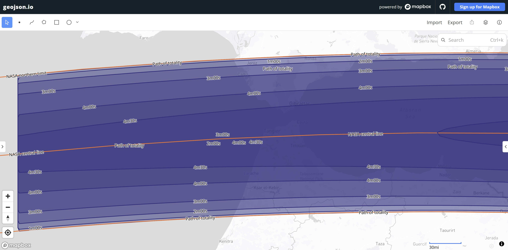
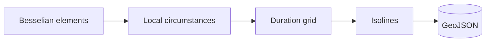

# Chasing totality

How long does totality last, place by place? This project computes it for the total solar eclipse of 2 August 2027 and draws it as isolines on a map.

**Stack:** TypeScript + Node 24, Fastify, Vitest, d3-contour



## Quick Overview



**Key Features:**
- ✅ Totality duration for any lat/lon, from NASA's Besselian elements
- ✅ Isolines every 30 s, from the path's edge up to 6 minutes, as GeoJSON
- ✅ Tested against NASA's path table and NASA's JSEX calculator

How it works, what was measured and what's left out: [spike #4 plan and findings](docs/plans/004-local-totality-duration-plan.md).

## Quick Start

### System requirements

- NVM (Node Version Management)
- Node.js >= 24
- PNPM 10.18.2 (via corepack)

### Development

```bash
nvm use
pnpm install

pnpm test        # run the tests
pnpm typecheck   # type-check without emitting
pnpm dev         # start the API with reload on port 3000
pnpm build       # compile src/ to dist/
pnpm start       # run the compiled API
pnpm spike:grid  # write the isolines to out/
```

The API reads `PORT` (default 3000) and `HOST` (default 0.0.0.0). `GET /health` answers `{"status":"ok"}`.

`pnpm spike:grid` writes two files:
- `out/2027-durations.geojson`: the isolines.
- `out/2027-nasa-path.geojson`: NASA's limits and central line, to compare against.

Drop both into [geojson.io](https://geojson.io) to see them on a map.

`pnpm spike:fixtures` regenerates `test/fixtures/jsex-2027.json` from NASA's JSEX. Only needed if the test points or the elements change.

### Docker

```bash
docker compose build
docker compose run --rm app pnpm test
docker compose run --rm app pnpm spike:grid  # out/ shows up on the host
docker compose up --build api                # production image, http://localhost:3000/health
```

## Project Structure

```
src/
└── engine/                # Everything that computes; a frontend/backend would only consume it
    ├── eclipse/           # Totality duration at one place
    │   ├── elements/      # Besselian elements per eclipse
    │   ├── besselian.ts   # Evaluates the elements at a given time
    │   ├── observer.ts    # Observer's position relative to the Earth's centre
    │   └── localCircumstances.ts  # Eclipse type, contact times and duration
    └── isolines/
        ├── grid.ts        # Engine values on a lat/lon grid
        └── contours.ts    # Grid to GeoJSON isolines
└── server/                # Fastify API
    ├── app.ts             # Builds the app and its routes
    └── main.ts            # Reads PORT/HOST, listens, shuts down cleanly

scripts/               # spike:grid, spike:fixtures
test/                  # Vitest tests and fixtures (NASA path table, JSEX)
docs/plans/            # Plans, deviations and findings
```
