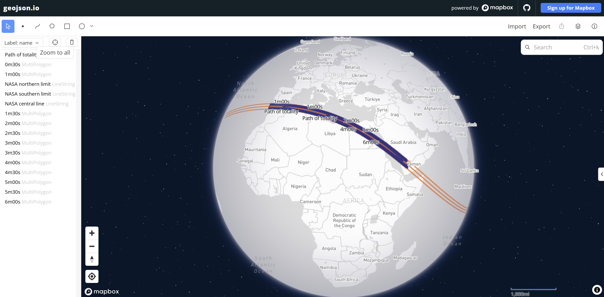
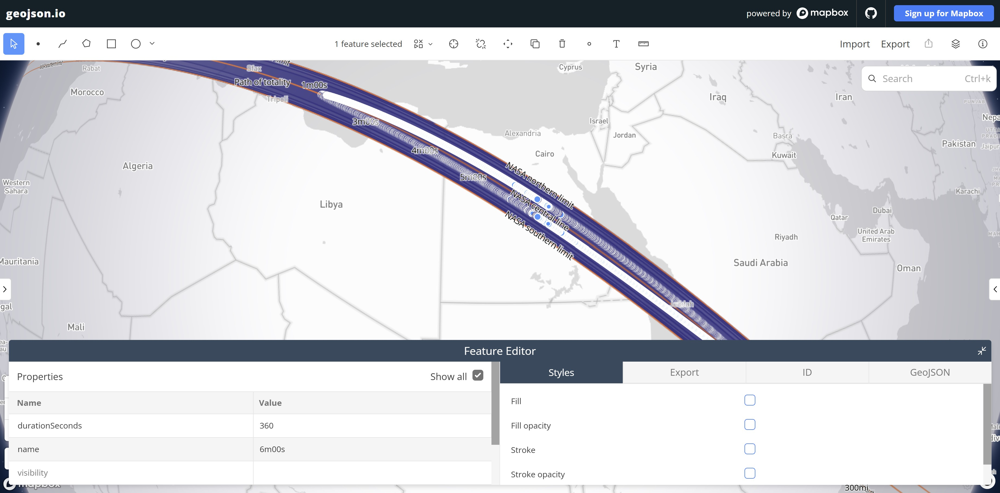

# Spike #4: can we calculate local totality duration?

## Context
The tool needs totality-duration isolines, but NASA's path tables only give the duration on the central line. This spike checks two things for the 2 Aug 2027 eclipse:
- Can we compute the duration for any lat/lon from Besselian elements? That's the method behind NASA's JSEX.
- Does a grid of those values produce sensible contours?

The repo is empty apart from package.json (pnpm).

**Decisions:**
- **Scope:** accurate results for the 2 Aug 2027 total eclipse over southern Spain and North Africa, which happens in the morning. Other eclipses, annular ones and other regions are nice to have.
- **Licensing: clean-room + oracle.** JSEX `program.js` is GPL-2.0-or-later, so we don't port it. We write our own TypeScript from the published maths (Meeus, *Elements of Solar Eclipses*; Explanatory Supplement ch. 11). The original JSEX code only runs inside a fixture script that downloads it at run time, and we commit only the JSON it outputs.
  - Caveat: this isn't a strict clean room, because I've already read program.js. The module follows the textbook formulation and its own structure (typed objects, not index arrays).
- **Delivery:** one branch, small reviewable commits, one PR that closes #4.
- **Test-first:** ~~each feature's tests land in a commit before the code that passes them~~. Those intermediate commits are deliberately red, and each one's message says so.

## Principles
- Keep the code clean and minimal, with no abstractions the spike doesn't need.
- Comment for a reader with little astronomy background:
  - Each module opens with a short plain-English explanation, e.g. what the fundamental plane is, why ρsinφ′/ρcosφ′, what L2′ < 0 means.
  - Each non-obvious formula gets a one-line *why* and a textbook reference.
- Keep docs to the point. Don't repeat what the code or other docs already say.
- The `src/eclipse/` layout is provisional and may move later.

## Research facts
- **2027-08-02 elements** (from JSEX `SE2001.js`, originally Espenak & Meeus, *Five Millennium Canon*, NASA public-domain data):
  - T0 = 2461619.922108 JD, t0 = 10h TDT, ΔT = 76.0 s
  - polynomials x[0..3], y[0..3], d[0..2], μ[0..2], l1[0..2], l2[0..2]
  - tan f1 = 0.0046064, tan f2 = 0.0045834
- **Method:**
  1. Compute the observer's geocentric ρsinφ′ and ρcosφ′.
  2. Project the observer into the fundamental plane (ξ, η, ζ, plus their rates).
  3. Newton-iterate to mid-eclipse (u·a + v·b = 0).
  4. The observer sees totality if m < |L2′| and L2′ < 0.
  5. Newton-iterate to C2 and C3.
  6. Duration = C3 − C2.
- **NASA oracle** (SE2027Aug02Tpath.html): north limit, south limit and central line every 120 s, with the central-line duration (e.g. 06m23.2s at 10:00 UT).

## Commits

### Setup
1. This plan.
2. Node 24: `.nvmrc`, plus `engines` and `"type": "module"` in package.json.
3. TypeScript:
   - `typescript` and `@types/node`
   - `tsconfig.json` (strict, NodeNext)
   - `typecheck` script
   - `.gitignore` (`node_modules`, `out/`)
4. Vitest: `vitest`, the `test` script and `vitest.config.ts` if needed.
5. Dockerfile:
   - `Dockerfile`: `node:24-slim`, corepack/pnpm, `pnpm install --frozen-lockfile`, `CMD pnpm test`
   - `.dockerignore`
6. Compose service:
   - `compose.yaml`: an `app` service that bind-mounts the repo, with an anonymous `node_modules` volume.
   - Then `docker compose run --rm app pnpm <script>` works and `out/` shows up on the host.

### Core calculation
7. Add NASA 2027 path fixture: `test/fixtures/SE2027Aug02Tpath.txt`, the table rows only.
8. Add NASA path table parser: `test/nasaPath.ts` plus its test.
9. Test Besselian element evaluation (red): polynomials at t = 0 and ~~t = 1~~ t = 2 match hand-computed values.
10. Besselian elements + 2027 data:
    - `src/eclipse/besselian.ts`: named-field type, plus `evaluate(el, t)` returning values and hourly rates.
    - `src/eclipse/elements/2027-08-02.ts`
11. Observer geocentric coordinates: `src/eclipse/observer.ts`. Input is lat and east-positive lon in degrees, plus altitude in m. Test:
    - equator: ρcosφ′ = 1, ρsinφ′ = 0
    - pole: ρsinφ′ ≈ 0.99665
    - altitude increases ρ
12. Local circumstances and totality duration:
    - `src/eclipse/localCircumstances.ts` returns `{type, mid, c2?, c3?, durationSeconds, sunAltitude}`.
    - Newton iterations have a tolerance and an iteration cap.
    - If a contact happens with the Sun below the horizon, the result flags it rather than silently giving a wrong answer.
    - Test:
      - Every central-line row matches NASA within ~~±1.0 s~~ ±0.5 s. The tolerance covers NASA's rounding and lunar-radius conventions.
      - ~~Every limit point gives ≤ ~5 s.~~
      - ~~A point 5 km outside a limit gives 0.~~
      - Every limit lies between 2 km inside and 2 km outside NASA's.
      - Halfway between the central line and a limit, the duration is strictly between 0 and the central value.
13. Agreement with JSEX:
    - Fixture generator:
      - `scripts/generate-jsex-fixtures.ts` and the `spike:fixtures` script.
      - It fetches `program.js` and `SE2001.js` at a pinned commit SHA.
      - It runs them in `node:vm` with `obsvconst` stubbed (`getall`/`getduration` don't touch the DOM).
    - Add JSEX 2027 fixtures: the generated `test/fixtures/jsex-2027.json`, about 20 points:
      - central line
      - inside the path: Luxor, Tarifa, Jeddah, Benghazi
      - ~~±5 km~~ ±1 km from the limits
      - outside the path: Madrid, Cairo, Sanaa
    - Test: same type everywhere, durations within ~~±0.1 s~~ ±0.01 s. It should pass straight away; if it doesn't, the fix goes in this commit.

### Grid + isolines
14. Isolines generation:
    - Duration grid: `src/isolines/grid.ts`. `durationGrid(el, bbox, stepDeg)` returns a `Float64Array` plus its dimensions, with a small test.
    - Contours to GeoJSON: `src/isolines/contours.ts` wraps `d3-contour` (thresholds every 30 s) and converts grid indices to lon/lat. Test: ~~the 0 s contour lies within ~2 km of NASA's limits, and contours are nested~~ each isoline is within 1 s of the engine's duration, and the 0 s one within 100 m of the engine's limit.
    - Spike-grid script: `scripts/spike-grid.ts` writes `out/2027-durations.geojson` and `out/2027-nasa-path.geojson` (the overlay).
    Grid: ~~0.1° over lon −45…75, lat −10…40 (~600k points)~~ 0.05° over lon −10…45, lat 15…40 (~550k points). The script logs its timing.

### Wrap-up
15. Docs:
    - Update README: a brief description plus how to run things (local and Docker).
    - Spike findings ~~go in the PR description, not the repo~~.
    - The limitations are the only lasting part. They stay as short comments in `localCircumstances.ts`: no lunar limb profile (about 1–2 km and 1–2 s), fixed ΔT, sunrise/sunset ends. TODO.

## Commit conventions
- Conventional prefixes: `chore:`, `feat:`, `fix:`, `test:`, `docs:`, `refactor:`.
- Each commit has one scope and a few files, so it's realistic to review.
- A commit whose `test:` is deliberately red says so in its body.
- After plan approval, I'll save these preferences (small commits, prefixes, TDD) to memory for future sessions.

## Optional tooling that would help
- **`gh` CLI or the GitHub MCP server**: `gh` isn't installed here. With either one I could read and update issue #4, tick its success criteria and open the PR. Otherwise you'd do that part by hand.
- **Playwright MCP**: lets me take the contour screenshot for the PR myself instead of you doing it in geojson.io.
- **Context7 MCP**: up-to-date docs for d3-contour, Vitest and TS config. Nice to have, not essential.
- **Built-in skills:** I'd use these at the end.
  - `/simplify` on the finished branch keeps the code minimal.
  - `/code-review` runs before the PR.
  - `dataviz` + an Artifact could give an interactive contour-vs-NASA map page as an alternative to the static screenshot. It's optional and only worth it if you want to share the result.

## Verification
- `docker compose build`, then `docker compose run --rm app pnpm test` and `pnpm typecheck` are green. They're also green locally on Node 24.
- `pnpm spike:fixtures` regenerates identical JSON.
- `pnpm spike:grid` writes the GeoJSON. Load both files in geojson.io and compare them with NASA's path map.
- Spot-check 2–3 arbitrary points by hand in NASA's live JSEX and note the results in the PR description.

## Deviations and findings

### Deviations
- From step 11 on, each test is committed together with its feature, not in a separate red commit.

- Contacts C2 and C3 (step 12):
  - Planned: found by Newton iteration, with a tolerance and an iteration cap.
  - Did: Newton first, then bisection if it doesn't settle.
  - Why: within ~0.1 mm of a limit, where totality lasts under 0.02 s, Newton jumps between a few values and hits the cap. The engine then threw an error, which would crash the grid if a point landed there. Bisection always settles.

- Duration grid (step 14):
  - Planned: the grid holds durations in seconds.
  - Did: it holds duration² inside the path, and a negative value outside that grows with the distance from the edge.
  - Why: isolines are interpolated linearly between grid points 5 km apart. The duration isn't linear near the edge (flat 0 outside, a steep rise just inside), so the edge came out up to 5.6 km too wide. The new value is linear across the edge, so the edge now lands within 30 m and every isoline within 1 s.

### Limitations
- Smooth Moon: the Moon's real edge has mountains and valleys, but we treat it as a perfect sphere. Sunlight passes through the valleys, so the real shadow is slightly smaller and has a ragged edge. As a result, the path's limits (the 0 s isoline) can be off by ~1–2 km, and durations by ~1–2 s.

- ΔT (the Earth's rotation correction): the Earth's spin is slowly and unevenly slowing down, so we can't know exactly where it will have turned to on the day. ΔT is the correction for that, and for 2027 it's a prediction. We use 76.0 s, as JSEX does; NASA's path table uses 71.7 s, so the tests against it switch to that value. The 4.3 s difference moves the whole path ~1.7 km east–west, which is why our isolines sit that far off the NASA overlay. Neither value is certain.

- Sea level: the engine can take each point's altitude, but the grid uses 0 m everywhere. A point on high ground sits a little closer to the Moon and sees the Sun from a slightly different angle, so the shadow reaches it slightly elsewhere. On high ground (e.g. 2,000 m), the limits can shift by a few hundred metres.

- Sunrise and sunset ends of the path: the shadow touches down at sunrise, in the Atlantic, and leaves at sunset, in the Indian Ocean. Near those ends, part of totality can happen with the Sun below the horizon. We flag that (sunBelowHorizon) but still report the full duration, so the visible duration there can be shorter. The air also bends sunlight, making the Sun look ~0.5° higher than it is. We ignore that, so the flag can be slightly off right at the horizon. None of this affects the 2027 area, Spain to the Red Sea, where the Sun is at least 33° up during totality.

### Findings
**Can we compute the duration for any lat/lon from Besselian elements?** Yes.
- NASA publishes the duration only along the central line of the path. Ours matches it within 0.3 s, and our path's edges are within 2 km of NASA's.
- JSEX, NASA's calculator, gives the duration for any point. At 54 points across the path, from Spain to Saudi Arabia, ours matches it within 0.001 s.
- Both use the same simplified model (see Limitations), so this shows the calculation is right, not that a real observer will see exactly that duration.

**Does a grid of those values produce sensible contours?** Yes.
- With grid points ~5 km apart, every isoline is within 1 s of the duration the engine gives at that spot, and the path's edge is within 30 m.
- The grid from Spain to the Red Sea (~550k points) takes ~4 s to compute and draw.
- In geojson.io, our path lines up with NASA's, apart from the ~1.7 km ΔT shift (see Limitations).

*Our isolines (purple, every 30 s) with NASA's limits and central line (orange). The grid covers Spain to the Red Sea; NASA's path carries on over the Atlantic and the Indian Ocean.*

*Strait of Gibraltar: isolines from the path's edge to 4m30s. Our edge follows NASA's northern and southern limits.*

*Libya to Saudi Arabia: the 6m00s isoline (selected) runs along NASA's central line, where totality is longest.*
