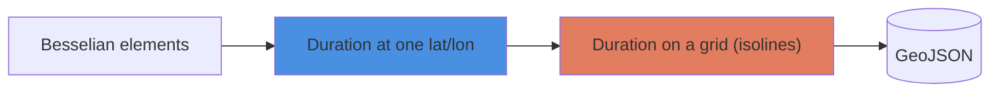
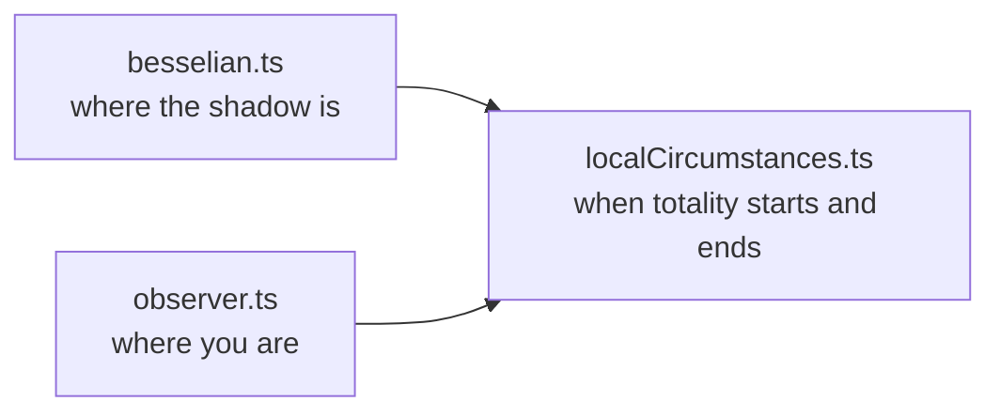
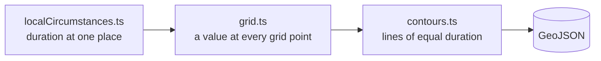

# Engine

The engine answers one question: **how long does totality last at a given place?** It then asks that question for thousands of places and draws the answers as lines on a map.



A solar eclipse happens when the Moon passes between the Sun and the Earth and casts its shadow on our planet.

Besselian elements describe that shadow, and NASA publishes a set for each eclipse. From them we can work out how long totality lasts at any one place: that's the job of [`eclipse/`](eclipse).

Then [`isolines/`](isolines) runs `eclipse/`over a grid of places and joins the places with equal durations into lines. It outputs them as GeoJSON, a standard map format that tools like geojson.io can draw.

How accurate it is, and what it leaves out: [spike #4 findings and limitations](../../docs/plans/004-local-totality-duration-plan.md#deviations-and-findings).

## Eclipse: totality at one place

The Moon casts two shadow cones. Inside the **umbra** (full shadow) the Sun is completely hidden: that's totality. Inside the wider **penumbra** only part of it is: a partial eclipse. As the Moon moves and the Earth turns, the umbra sweeps a narrow band across the Earth, the **path of totality**.

```
  Sun               Moon
                     .-.   .  .  penumbra (partial)  .
  ── light ──>      (   )════ umbra (total) ════▶ Earth
                     '-'   '  '  '  '  '  '  '  '  '  '
```

Three files work out how long totality lasts at one place: where the shadow is, where you are, and how the two meet.



### besselian.ts

Rather than tracking the shadow in 3D, astronomers slice it with a flat plane, the **fundamental plane**: through the Earth's centre, square to the Sun–Moon line. On that plane the shadow is just two circles, and the eclipse becomes a flat geometry problem.

```
  side view (not to scale)

                             ┊ plane
           .  '  '  '  '  '  ┊  '  '  '   penumbra: widens
                         .---┊---.
   Moon ( )═════════════(════┊════) Earth
                         '---┊---'
           '  .  .  .  .  .  ┊  .  .  .
                             ┊
  ═══ umbra: narrows
```

```
  the plane, seen from the Sun (not to scale)

     y (north)
     │                      shadow moving ──>
     │         .-'''''''''''''''-.
     │      .'                     '.
     │    .'        .-'''''-.        '.
     │   :         :         :         :
   y ┼┄┄┄:┄┄┄┄┄┄┄┄┄:┄┄┄┄+────┼─────────┤
     │   :         :    ┆├─l2┤         :
     │   :         :    ┆├──────l1─────┤
     │    '.        '-..┆..-'        .'
     │      '.          ┆          .'
     │         '-.......┆.......-'
     │                  ┆
  ───●──────────────────┼────────────────── x (east)
     Earth's centre     x

  + shadow axis, at (x, y)
  l1  penumbra radius
  l2  umbra radius
```

NASA publishes each eclipse as **Besselian elements**: a handful of short polynomials in time that give, on that plane:
- `x`, `y`: where the shadow's axis crosses it, in Earth radii;
- `l1`, `l2`: the radii of the penumbra and umbra circles (`l2` is negative when the umbra reaches the Earth, a total eclipse; positive means annular);
- `d`, `μ`: how the plane is tilted and turned relative to the Earth.

The published numbers live in `elements/`, one file per eclipse. `evaluate()` takes them and a time, and returns where the shadow is at that moment and how fast it's moving.

### observer.ts

The Earth is slightly flattened, so the direction from its centre to the observer differs a little from the observer's map latitude. The eclipse maths needs the observer's position as two lengths:

```
           N
           │      • observer
           │     /┆
           │    / ┆ ρ·sinφ′: height above the equator
           │   /  ┆
  ─────────●──────┴─────────── equator
        centre
           └──────┘
           ρ·cosφ′: distance from the Earth's axis
```

`geocentricObserver()` returns these two lengths, ρ·sinφ′ and ρ·cosφ′, based on the observer's latitude, longitude and altitude.

### localCircumstances.ts

`localCircumstances()` puts the observer on the same plane as the shadow, by combining the results of `evaluate()` (the shadow) and `geocentricObserver()` (the observer).

Both move: the shadow sweeps east, and the Earth's spin carries the observer along more slowly. It's easier to picture from the shadow's point of view. Hold the shadow still, and the observer slides across it in a line:

```
  the plane, as seen riding on the shadow

              .-----------.
            /    umbra     \
  ─────────C2───────●──────C3─────> observer, sliding across
           |        ┆ m     |
           |        +       |
            \              /
              '-----------'

  ────────────────────────────────> someone further away:
                                    misses the umbra, no totality

  + centre of the shadow
  m your closest distance to it
```

1. **Mid-eclipse (●)**: when the observer is closest to the centre.
3. **C2** and **C3**: when the observer enters and leaves the umbra. The duration is C3 − C2.

Remember an observer outside the umbra will miss totality, but may still pass through the penumbra (partial) or miss the shadow entirely.

`localCircumstances()` finds mid-eclipse, C2 and C3 by Newton iteration. The shadow and the observer both move with time, the observer along a curve as the Earth turns, so the moment they meet has no direct formula. Each time is estimated, then refined until it changes by less than ~4 ms. Within ~0.1 mm of the path's edge, C2 and C3 are milliseconds apart and Newton iteration can bounce between values without settling. There, the engine falls back to bisection, halving the interval until it's small enough, which always settles.

The fundamental plane passes straight through the Earth, so places on the night side also fall inside the shadow circle. If the Sun is below the observer's horizon for the whole of totality, the result is `none`; if only for part of it, `sunBelowHorizon` is set.

## Isolines: lines of equal duration

Two files turn durations at single places into lines on a map: `grid.ts` asks `localCircumstances()` for the duration at many places, and `contours.ts` joins the places with equal durations into lines.



### grid.ts

`durationGrid()` calls `localCircumstances()` at every point of a regular lat/lon grid, at sea level, and stores `signedDurationSquared` for each point, row by row from the south-west corner.

```
  north ┬ · · · · · · · ·
        │ · · · · · · · ·    each · is one place,
        │ · · · · · · · ·    e.g. 0.05° (~5 km) apart
  south ┴ · · · · · · · ·
       west            east
```

**Why not store the duration?*** The contour tracer draws a line between two grid points by assuming the value changes evenly between them. The duration doesn't, at the edge of the path: it's 0 outside, then jumps within a few hundred metres. With points 5 km apart, that drew the edge up to 5.6 km off.

```
  duration
     │           .-------------
     │          /
     │         |  steep jump just inside
     │         |
   0 └─────────┴──────────────────▶ inwards
       outside edge  inside
```

`signedDurationSquared` changes evenly across the edge: it's the duration squared inside the path, and negative outside, more so the further away. The tracer puts lines in the right place.

```
  signedDurationSquared
     │                     /
     │                   /
     │                 /  rises evenly
   0 ┼─────────────●──────────────▶ inwards
     │           / edge
     │         /
     │       /
       outside       inside
```

### contours.ts

`durationContours()` takes the grid from `durationGrid()` and the durations to draw, in seconds, and traces a line for each with [d3-contour](https://github.com/d3/d3-contour). The grid holds squared values, so each duration is squared too. The lines are then converted from grid positions back to longitude/latitude. The output is GeoJSON, a standard map format, with one feature per duration:

```json
{
  "type": "Feature",
  "properties": { "durationSeconds": 240, "name": "4m00s" },
  "geometry": { "type": "MultiPolygon", "coordinates": [ ... ] }
}
```

- Each feature is the **area** where totality lasts at least that long, and its outline is the isoline. So the features nest, like the layers of an onion.
- The 0 s feature is the path of totality itself, named `"Path of totality"`.
- A duration no place reaches is left out, e.g. 6m30s, when the longest is ~6m23s.

### The script: spike-grid

[`scripts/spike-grid.ts`](../../scripts/spike-grid.ts) chains both steps for the 2027 eclipse:

```
  durationGrid()      Spain to the Red Sea, every 0.05°
        │             (~550k places)
        ▼
  durationContours()  every 30 s, from 0 s to 6m00s
        │
        ▼
  out/2027-durations.geojson   the isolines
  out/2027-nasa-path.geojson   NASA's path, to compare
```

Run it with (refer to main [README](../../README.md) for how to setup the project):

```bash
pnpm spike:grid
```

## Glossary

| Term | Meaning |
|---|---|
| Umbra, penumbra | The Moon's full and partial shadow |
| Path of totality | The band on the Earth swept by the umbra |
| Fundamental plane | A plane through the Earth's centre, square to the Sun–Moon line, on which the shadow is described |
| Besselian elements | NASA's polynomials describing the shadow on the fundamental plane |
| C2, C3 | Start and end of totality (C1 and C4 are the start and end of the partial eclipse) |
| Mid-eclipse | The moment the observer is closest to the shadow's axis |
| Isoline | A line joining places where totality lasts the same time |
| TDT, UT, ΔT | Two time scales: a uniform one the elements use (TDT), and one that follows the Earth's spin (UT). ΔT is the gap between them. |

## References

- Explanatory Supplement to the Astronomical Almanac (3rd ed., 2013), ch. 11.
- Meeus, *Elements of Solar Eclipses 1951–2200*.
- Meeus, *Astronomical Algorithms* (2nd ed., 1998), ch. 11 (observer's position).
